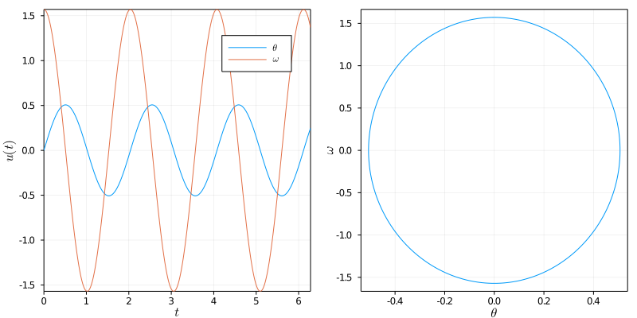
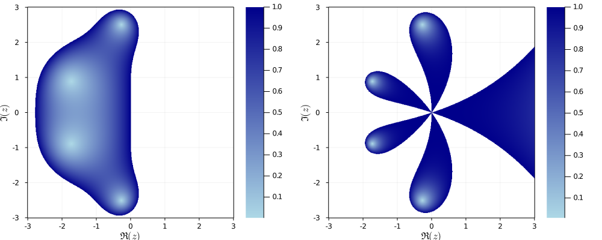

# RungeKutta

A Julia package implementing Runge-Kutta methods.

[](https://github.com/antonuccig/RungeKutta.jl/actions)
[](https://codecov.io/gh/antonuccig/RungeKutta.jl)

## Usage

Let's say that we want to solve the [simple gravity pendulum problem](https://en.wikipedia.org/wiki/Pendulum_(mathematics)#Simple_gravity_pendulum) using the [midpoint method](https://en.wikipedia.org/wiki/Midpoint_method). Here is how to do it with `RungeKutta`:

```julia
using RungeKutta
f(u, t) = [u[2]; -9.81 * sin(u[1])]
u0 = [0.0; π/2]
tspan = (0.0, 2π)
problem = IVP(f, u0, tspan)
solver = Midpoint(h = 1e-2)
solution = solve(problem, solver)
```

We can plot the obtained `solution` by extracting its fields `u` and `t`, e.g. with the convenient macro `@↓ solution = u, t` from `NSDEBase`. Or we can use the predefined recipes:

```julia
using Plots, LaTeXStrings
plot(
  size = (800, 400),
  plot(solution, label = [L"$\theta$" L"$\omega$"], legend = true),
  phaseplot(solution, vars = (1, 2), xlabel = L"$\theta$", ylabel = L"$\omega$", widen = true)
)
```



`RungeKutta` has predefined recipes to plot stability regions and order stars too:

```julia
plot(
  size = (1000, 400),
  stabilityf(RK4(), colour = :blues),
  orderstarf(RK4(), colour = :blues)
)
```




`RungeKutta.jl` currently supports explicit (`Euler`/`ExplicitEuler`, `Heun2`, `Ralston2`, `Midpoint`/`ExplicitMidpoint`, `Heun3`, `Kutta3`, `Ralston3`, `SSPRK3`, `RK4`, `Rule38`, `Fehlberg45`/`F45`, `DormandPrince54`/`DP54`, `Verner65`/`V65`), diagonally implicit (`SDIRK3`) and fully implicit methods (`BackwardEuler`/`ImplicitEuler`, `ImplicitMidpoint`, `CrankNicolson`, `SDIRK3`, `HammerHollingsworth`/`HH4`, `LobattoIIIA4`, `RadauIIA5`).

## Installation

`RungeKutta` is compatible with Julia `v1.0` and above, and it can be installed by cloning this repository:
```julia
]add https://github.com/antonuccig/RungeKutta.jl
```

## What's in the pipeline

- Add IMEX methods.
- Make ``stability`` decide the size of the plottable area automatically.
- Improve performances.
- Improve error messages.
- Add other time-steppers from [wikipedia](https://en.wikipedia.org/wiki/List_of_Runge–Kutta_methods).
