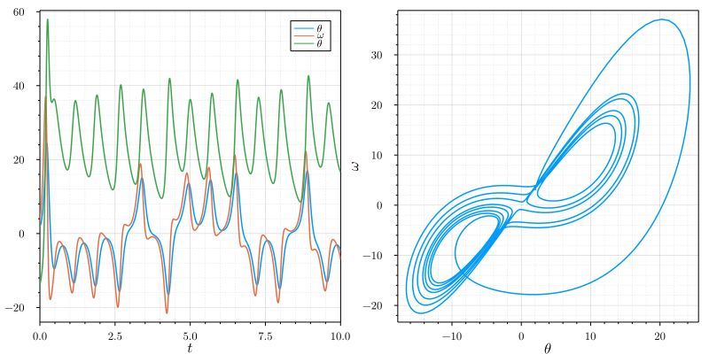
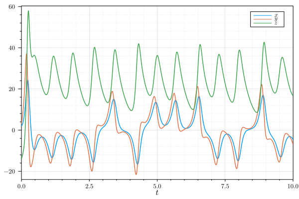
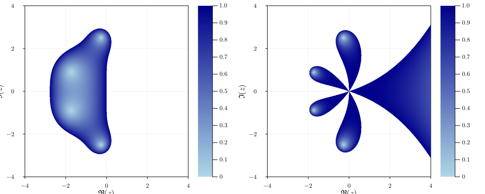

# RungeKutta

A Julia package implementing Runge-Kutta methods.

[](https://github.com/antonuccig/RungeKutta.jl/actions)
[](https://codecov.io/gh/antonuccig/RungeKutta.jl)

## Installation

`RungeKutta` is compatible with Julia `v1.0` and above. From the Julia REPL,
```julia
]add https://github.com/antonuccig/RungeKutta.jl
```

## Usage

Let's say that we want to solve the [simple gravity pendulum problem](https://en.wikipedia.org/wiki/Pendulum_(mathematics)#Simple_gravity_pendulum) using the [midpoint method](https://en.wikipedia.org/wiki/Midpoint_method). Here is how to do it with `RungeKutta`:

```julia
using RungeKutta
f(u, t) = [u[2]; -9.81 * sin(u[1])]
u0 = [0.0; π/2]
tspan = (0.0, 2π)
problem = IVP(f, u0, tspan)
solver = Midpoint(h = 1e-2)
solution = solve(problem, solver)
```

We can plot the obtained `solution` by extracting its fields `u` and `t`, e.g. with the convenient macro `@↓ u, t = solution` from `ArrowMacros`. Alternatively, we can use the predefined recipes:

```julia
using Plots, LaTeXStrings
default(fontfamily = "Computer Modern")
plot(
  size = (800, 400),
  plot(solution, xlabel = L"t", label = [L"\theta" L"\omega"], legend = true),
  phaseplot(solution, vars = (1, 2), xlabel = L"\theta", ylabel = L"\omega")
)
# savefig("pendulum.svg")
```



`RungeKutta` comes with some predefined ODE problems, like the [Lorenz system](https://en.wikipedia.org/wiki/Lorenz_system):

```julia
u0 = [2.0, 3.0, -14.0]
tspan = (0.0, 10.0)
problem = Lorenz(u0, tspan)
solver = F45(h = 1e-3)
solution = solve(problem, solver)
plot(solution, xlabel = L"t", label = [L"x" L"y" L"z"], legend = true)
# savefig("lorenz.svg")
```



`RungeKutta` has also predefined recipes to plot stability regions and order stars:

```julia
plot(
  size = (1000, 400),
  stabilityf(RK4(), xlabel = L"\Re(z)", ylabel = L"\Im(z)", colour = :blues),
  orderstarf(RK4(), xlabel = L"\Re(z)", ylabel = L"\Im(z)", colour = :blues)
)
# savefig("regions.svg")
```



## Methods

`RungeKutta` currently supports the following methods:

<!-- explicit (`Euler`/`ExplicitEuler`, `Midpoint`/`ExplicitMidpoint`, `Heun2`, `Ralston2`, `Heun3`, `Kutta3`, `Ralston3`, `SSPRK3`, `RK4`, `Rule38`, `HeunEuler`, `Fehlberg45`/`F45`, `DormandPrince54`/`DP54`, `Verner65`/`V65`) and implicit methods (`BackwardEuler`/`ImplicitEuler`, `ImplicitMidpoint`, `CrankNicolson`, `SDIRK3`, `GaussLegendre4`/`GL4`, `GaussLegendre6`/`GL6`, `LobattoIIIA4`, `LobattoIIIB2`, `LobattoIIIB4`, `LobattoIIIC2`, `LobattoIIIC4`, `RadauIA3`, `RadauIA5`, `RadauIIA3`, `RadauIIA5`). -->

<details><summary>Explicit</summary>

- `Euler`/`ExplicitEuler`
- `Midpoint`/`ExplicitMidpoint`
- `Heun2`
- `Ralston2`
- `Heun3`
- `Kutta3`
- `Ralston3`
- `SSPRK3`
- `RK4`
- `Rule38`
- `HeunEuler`
- `Fehlberg45`/`F45`
- `DormandPrince54`/`DP54`
- `Verner65`/`V65`

</details>

<details><summary>Implicit</summary>

- `BackwardEuler`/`ImplicitEuler`
- `ImplicitMidpoint`
- `CrankNicolson`
- `SDIRK3`
- `GaussLegendre4`/`GL4`
- `GaussLegendre6`/`GL6`
- `LobattoIIIA4`
- `LobattoIIIB2`
- `LobattoIIIB4`
- `LobattoIIIC2`
- `LobattoIIIC4`
- `RadauIA3`
- `RadauIA5`
- `RadauIIA3`
- `RadauIIA5`

</details>

## What's next?

Current plans for future developments are:
- Improve performance and error messages.
- Automatic size detection of stability region.
- IMEX methods.
