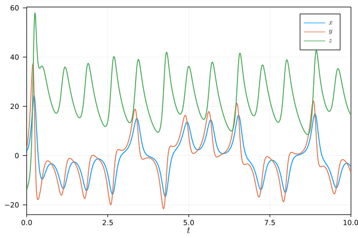

# RungeKutta

[](https://github.com/antonuccig/RungeKutta.jl/actions)
[](https://codecov.io/gh/antonuccig/RungeKutta.jl)

<details><summary><b>Usage</b></summary>

Let's say that we want to solve the [simple gravity pendulum problem](https://en.wikipedia.org/wiki/Pendulum_(mathematics)#Simple_gravity_pendulum) using the [midpoint method](https://en.wikipedia.org/wiki/Midpoint_method). Here is how to do it with `RungeKutta`:

```julia
using RungeKutta
f(u, t) = [u[2]; -9.81 * sin(u[1])]
u0 = [0.0; π/2]
tspan = (0.0, 2π)
problem = IVP(f, u0, tspan)
solver = Midpoint(h = 1e-2)
solution = solve(problem, solver)
```

We can plot the obtained `solution` by extracting its fields `u` and `t`, e.g. with the convenient macro `@↓ u, t = solution` from `ArrowMacros`. Alternatively, we can use the predefined recipes:

```julia
using Plots, LaTeXStrings
plot(
  size = (800, 400), fmt = :svg,
  plot(solution, xlabel = L"t", label = [L"\theta" L"\omega"], legend = true),
  phaseplot(solution, vars = (1, 2), xlabel = L"\theta", ylabel = L"\omega")
)
```


`RungeKutta` comes with some predefined ODE problems, like the [Lorenz system](https://en.wikipedia.org/wiki/Lorenz_system):

```julia
u0 = [2.0, 3.0, -14.0]
tspan = (0.0, 10.0)
problem = Lorenz(u0 = u0, tspan = tspan)
solver = F45(h = 1e-3)
solution = solve(problem, solver)
plot(solution, xlabel = L"t", label = [L"x" L"y" L"z"], legend = true)
```



`RungeKutta` has also predefined recipes to plot stability regions and order stars:

```julia
plot(
  size = (1000, 400),
  stabilityf(RK4(), xlabel = L"\Re(z)", ylabel = L"\Im(z)", colour = :blues),
  orderstarf(RK4(), xlabel = L"\Re(z)", ylabel = L"\Im(z)", colour = :blues)
)
```


</details>

<details><summary><b>Methods</b></summary>

`RungeKutta.jl` currently supports explicit (`Euler`/`ExplicitEuler`, `Midpoint`/`ExplicitMidpoint`, `Heun2`, `Ralston2`, `Heun3`, `Kutta3`, `Ralston3`, `SSPRK3`, `RK4`, `Rule38`, `HeunEuler`, `Fehlberg45`/`F45`, `DormandPrince54`/`DP54`, `Verner65`/`V65`) and implicit methods (`BackwardEuler`/`ImplicitEuler`, `ImplicitMidpoint`, `CrankNicolson`, `SDIRK3`, `GaussLegendre4`/`GL4`, `GaussLegendre6`/`GL6`, `LobattoIIIA4`, `LobattoIIIB2`, `LobattoIIIB4`, `LobattoIIIC2`, `LobattoIIIC4`, `RadauIA3`, `RadauIA5`, `RadauIIA3`, `RadauIIA5`).

Current plans for further developments are:
- improve performance and error messages.
- automatic size detection of stability region.
- IMEX methods.

</details>

<details><summary><b>Installation</b></summary>

`RungeKutta` is compatible with Julia `v1.0` and above, and it can be installed from the REPL by cloning this repository:
```julia
]add https://github.com/antonuccig/RungeKutta.jl
```
</details>
