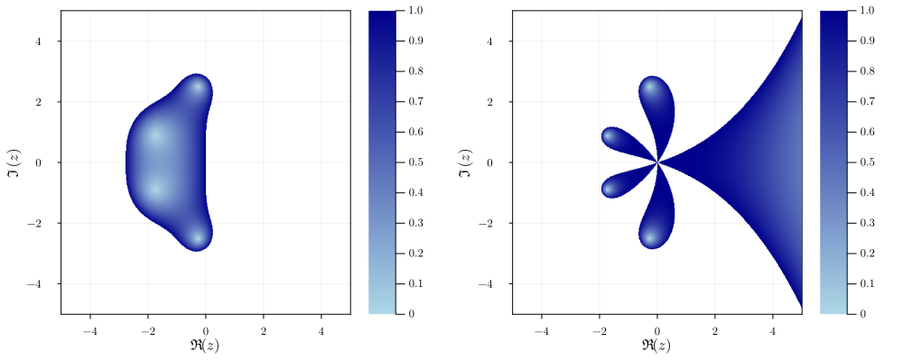

# NSDERungeKutta.jl

A Julia package implementing Runge-Kutta methods.

[](https://giancarloantonucci.github.io/NSDERungeKutta.jl/dev) [](https://github.com/giancarloantonucci/NSDERungeKutta.jl/actions) [](https://codecov.io/gh/giancarloantonucci/NSDERungeKutta.jl)

## Installation

This package is a [registered package](https://juliahub.com/ui/Search?q=NSDERungeKutta&type=packages) compatible with Julia v1.6 and above. From the Julia REPL,

```
]add NSDERungeKutta
```

Read the [documentation](https://giancarloantonucci.github.io/NSDERungeKutta.jl/dev) for a complete overview of this package.

## Usage

Let's say that we want to solve the [simple gravity pendulum problem](https://en.wikipedia.org/wiki/Pendulum_(mathematics)#Simple_gravity_pendulum) using the [midpoint method](https://en.wikipedia.org/wiki/Midpoint_method). Here is one way to do it with NSDERungeKutta.jl:

```julia
using NSDERungeKutta
f(u, t) = [u[2]; -sin(u[1])]
u0 = [0.0; π/4]
tspan = (0.0, 2π/3 * √9.81)
problem = IVP(f, u0, tspan)
solver = Midpoint(h = 1e-2)
solution = solve(problem, solver)
```

We can plot the obtained `solution` by extracting its fields `u` and `t`, e.g. using the convenient macro `@↓ u, t = solution` from [ArrowMacros.jl](https://github.com/giancarloantonucci/ArrowMacros.jl). Alternatively, we can use the available predefined recipes:

```julia
using Plots, LaTeXStrings
gr(fontfamily = "Computer Modern", framestyle = :box, label = "", tickdirection = :out)
p₁ = plot(solution, xlabel = L"t", label = [L"\theta" L"\omega"])
p₂ = phaseplot(solution, variables = (1, 2), xlabel = L"\theta", ylabel = L"\omega")
plot(size = (900, 450), p₁, p₂, left_margin = 3Plots.mm, bottom_margin = 3Plots.mm)
```


For convenience, this package re-exports all the ODE problems defined in [NSDEBase.jl](https://github.com/giancarloantonucci/NSDEBase.jl), e.g. `SimplePendulum` for the above problem.

This package has some predefined recipes to plot **stability regions** and **order stars** too:

```julia
p₁ = stabilityf(RK4(), xlabel = L"\Re(z)", ylabel = L"\Im(z)", colour = :blues, resolution = 500)
p₂ = orderstarf(RK4(), xlabel = L"\Re(z)", ylabel = L"\Im(z)", colour = :blues, resolution = 500)
plot(size = (1000, 400), p₁, p₂, left_margin = 5Plots.mm, bottom_margin = 5Plots.mm)
```



## Available methods

This package currently supports the following methods:

**Explicit**: `Euler`/`ExplicitEuler`, `Midpoint`/`ExplicitMidpoint`, `Heun2`, `Ralston2`, `Heun3`, `Kutta3`, `Ralston3`, `SSPRK3`, `RK4`, `Rule38`, `HeunEuler`, `Fehlberg45`/`F45`, `DormandPrince54`/`DP54`, `Verner65`/`V65`.

**Implicit**: `BackwardEuler`/`ImplicitEuler`, `ImplicitMidpoint`, `CrankNicolson`, `SDIRK3`, `GaussLegendre4`/`GL4`, `GaussLegendre6`/`GL6`, `LobattoIIIA4`, `LobattoIIIB2`, `LobattoIIIB4`, `LobattoIIIC2`, `LobattoIIIC4`, `RadauIA3`, `RadauIA5`, `RadauIIA3`, `RadauIIA5`.
