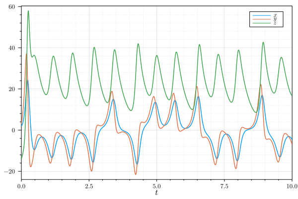

# Examples

## Lorenz

and `Lorenz` for [Lorenz's ODEs](https://en.wikipedia.org/wiki/Lorenz_system):

```julia
u0 = [2.0, 3.0, -14.0]
tspan = (0.0, 10.0)
problem = Lorenz(u0, tspan)
solver = F45(h = 1e-3)
solution = solve(problem, solver)
plot(solution, xlabel = L"t", label = [L"x" L"y" L"z"])
```



## What's next?

Current plans for future developments are:

- Improve performance and error messages.
- Automatic size detection of stability region.
- IMEX methods, etc.
