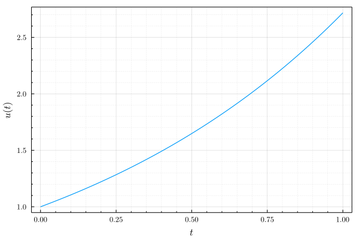
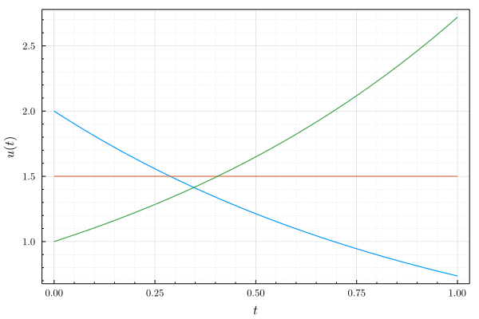
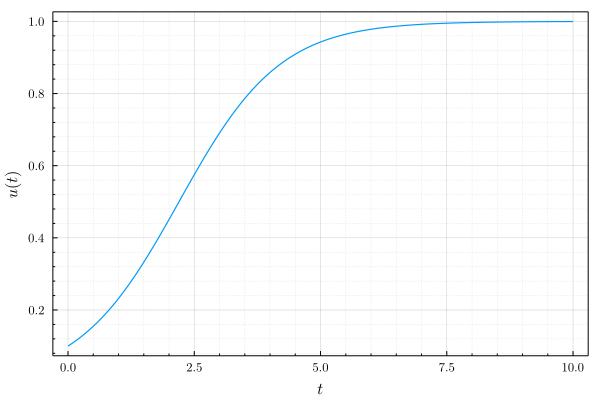
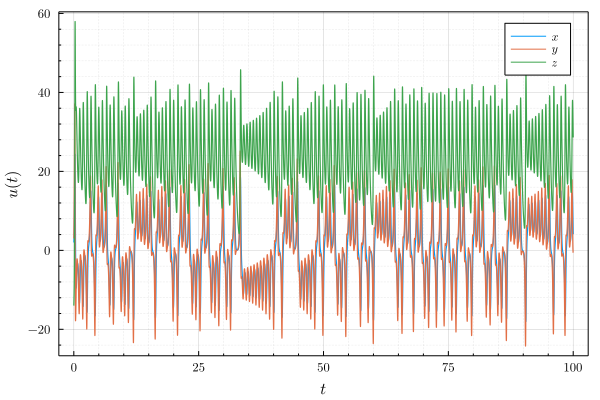

# Examples

```jl
using Revise
using RungeKutta
using Plots, LaTeXStrings
gr(
    fontfamily = "Computer Modern",
    framestyle = :box,
    label = "",
    linewidth = 1.2,
    size = (600, 400),
)
```

## Dahlquist

```jl
u0 = 1.0
tspan = (0.0, 1.0)
problem = Dahlquist(u0, tspan)
finesolver = Euler(h = 1e-3)
finesolution = solve(problem, finesolver)
plot(finesolution, xlabel = L"$t$", ylabel = L"$u(t)$")
# savefig("dahlquist1.svg")
```



```jl
using LinearAlgebra
u0 = [2.0, 1.5, 1.0]
tspan = (0.0, 1.0)
problem = Dahlquist(u0, tspan, λ = diagm([-1.0, 0.0, 1.0]))
finesolver = BackwardEuler(h = 1e-3)
finesolution = solve(problem, finesolver)
plot(finesolution, xlabel = L"$t$", ylabel = L"$u(t)$")
# savefig("dahlquist2.svg")
```



## Logistic

```jl
u0 = 0.1
tspan = (0.0, 10.0)
problem = Logistic(u0, tspan)
finesolver = RK4(h = 1e-3)
finesolution = solve(problem, finesolver)
plot(finesolution, xlabel = L"$t$", ylabel = L"$u(t)$")
# savefig("logistic1.svg")
```



## Lorenz

```julia
u0 = [2.0, 3.0, -14.0]
tspan = (0.0, 100.0)
problem = Lorenz(u0, tspan)
solver = F45(h = 1e-3)
solution = solve(problem, solver)
plot(solution, label = [L"x" L"y" L"z"], xlabel = L"t", ylabel = L"$u(t)$")
# savefig("lorenz1.svg")
```


