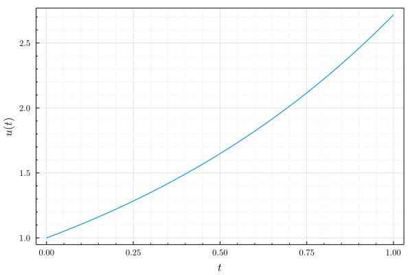
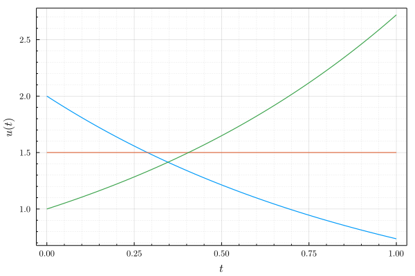
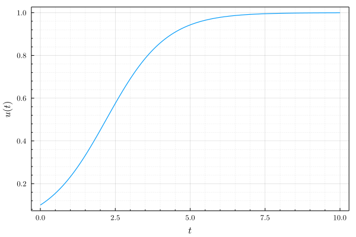
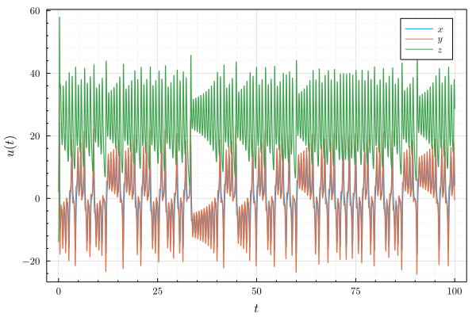

# Examples

```jl
using NSDERungeKutta
using Plots, LaTeXStrings
gr(fontfamily="Computer Modern", framestyle=:box, label="", tickdirection=:out)
```

## Dahlquist

```jl
u0 = 1.0
tspan = (0.0, 1.0)
problem = Dahlquist(u0, tspan)
solver = Euler(h=1e-3)
solution = solve(problem, solver)
plot(solution, xlabel=L"$t$", ylabel=L"$u(t)$")
# savefig("dahlquist1.svg")
```



```jl
using LinearAlgebra
u0 = [2.0, 1.5, 1.0]
tspan = (0.0, 1.0)
problem = Dahlquist(u0, tspan, λ=diagm([-1.0, 0.0, 1.0]))
solver = BackwardEuler(h=1e-3)
solution = solve(problem, solver)
plot(solution, xlabel=L"$t$", ylabel=L"$u(t)$")
# savefig("dahlquist2.svg")
```



## Logistic

```jl
u0 = 0.1
tspan = (0.0, 10.0)
problem = Logistic(u0, tspan)
solver = RK4(h=1e-3)
solution = solve(problem, solver)
plot(solution, xlabel=L"$t$", ylabel=L"$u(t)$")
# savefig("logistic1.svg")
```



## Lorenz

```julia
u0 = [2.0, 3.0, -14.0]
tspan = (0.0, 100.0)
problem = Lorenz(u0, tspan)
solver = Fehlberg45(h=1e-3)
solution = solve(problem, solver)
plot(solution, label = [L"x" L"y" L"z"], xlabel=L"t", ylabel=L"$u(t)$")
# savefig("lorenz1.svg")
```



## Allen–Cahn: stabilised IMEX by convexity splitting

The 1-D Allen–Cahn equation ``u_t = \Delta u - \tfrac{2}{\varepsilon^2}\,u(1-u)(1-2u)`` (double-well form on ``[0, 1]``) is the classic case where the *obvious* IMEX split — diffusion implicit, reaction explicit — still carries a stiff restriction ``\Delta t \lesssim \varepsilon^2``, because the explicit reaction term stiffens as ``\varepsilon \to 0``.

Convexity splitting (Eyre's trick; see e.g. the sharp-interface-limit literature) fixes this **without any new solver**: add and subtract a stabilisation term ``k u`` with ``k = 2/\varepsilon^2``, fold ``-kI`` into the implicit linear part and ``+ku`` into the explicit part. The equation is unchanged; the split is not. With `SplitRightHandSide` this is a two-line fold:

```jl
using NSDERungeKutta, LinearAlgebra

n  = 128
Δx = 1 / n
x  = collect(0:Δx:1-Δx)
ε  = 0.04
k  = 2 / ε^2                                     # stabilisation shift

Δ = Matrix((1 / Δx^2) * SymTridiagonal(-2ones(n), ones(n - 1)))
Δ[1, n] = Δ[n, 1] = 1 / Δx^2                     # periodic boundary

f(u, t) = @. (-2 / ε^2) * u * (1 - u) * (1 - 2u) + k * u   # reaction, shifted UP

u0 = @. 0.5 * (1 + tanh((0.25 - abs(x - 0.5)) / (√2 * ε))) # smoothed interface
problem = IVP(SRHS(Δ - k * I, RHS(f)), u0, (0.0, 0.02))    # linear part, shifted DOWN
solution = solve(problem, IMEXEuler(h = 1e-3))
```

Each `IMEXEuler` step now solves ``(\tfrac{1}{\Delta t}I - \Delta + kI)\,u^+ = \tfrac{1}{\Delta t}u + f(u) + k u`` — the stabilised scheme from the Allen–Cahn literature, obtained here purely by re-splitting the right-hand side. Two honest caveats: the stabilisation buys **stability, not accuracy** (the scheme stays first order, and large steps smear the interface dynamics accordingly); and the shift ``k`` is problem-specific — ``2/\varepsilon^2`` bounds the reaction term's Jacobian for the double-well on ``[0, 1]``, and a different potential needs its own bound.

## Adaptive stepping: stability versus accuracy

Two linear systems engineered to share the **same** exact solution ``u(t) = [2e^{-t} + \sin t,\; 2e^{-t} + \cos t]`` — one with Jacobian eigenvalues ``\{-1, -3\}``, the other ``\{-1, -1000\}``. Since the solutions are identical, equal *accuracy* demands similar step counts; every extra step the stiff twin takes is the price of explicit *stability*:

```jl
using NSDERungeKutta, LinearAlgebra, Printf

u0 = [2.0, 3.0]
tspan = (0.0, 10.0)
f₁(u, t) = [-2.0 1.0; 1.0 -2.0] * u + [2sin(t), 2(cos(t) - sin(t))]        # eigenvalues {-1, -3}
f₂(u, t) = [-2.0 1.0; 998.0 -999.0] * u + [2sin(t), 999(cos(t) - sin(t))]  # eigenvalues {-1, -1000}

for (name, f) in (("non-stiff", f₁), ("stiff", f₂))
    solver = Fehlberg45(h = 0.1, εᵣ = 1e-2, save_stepsizes = true)
    solution = solve(IVP(RHS(f), u0, tspan), solver)
    steps = diff(solution.t)
    rejections = sum(length, solver.stepsize.hs.rejected)
    @printf "%-9s steps=%5d  rejections=%4d  min h=%.2e  max h=%.2e\n" name length(steps) rejections minimum(steps) maximum(steps)
end
```

The non-stiff run takes the few dozen steps the tolerance asks for; the stiff run takes thousands, pinned near the explicit stability boundary ``h \lesssim 2.8/1000`` however loose the tolerance — and its rejection count is that boundary made visible. When a system behaves like the stiff twin, an implicit or IMEX solver (see the Allen–Cahn example above) is the answer, not a smaller tolerance.

With `save_stepsizes = true` the record is the *realised* history: `solver.stepsize.hs.accepted` equals `diff(solution.t)` exactly, and `hs.rejected[i]` holds the step sizes that failed before accepted step `i`.
